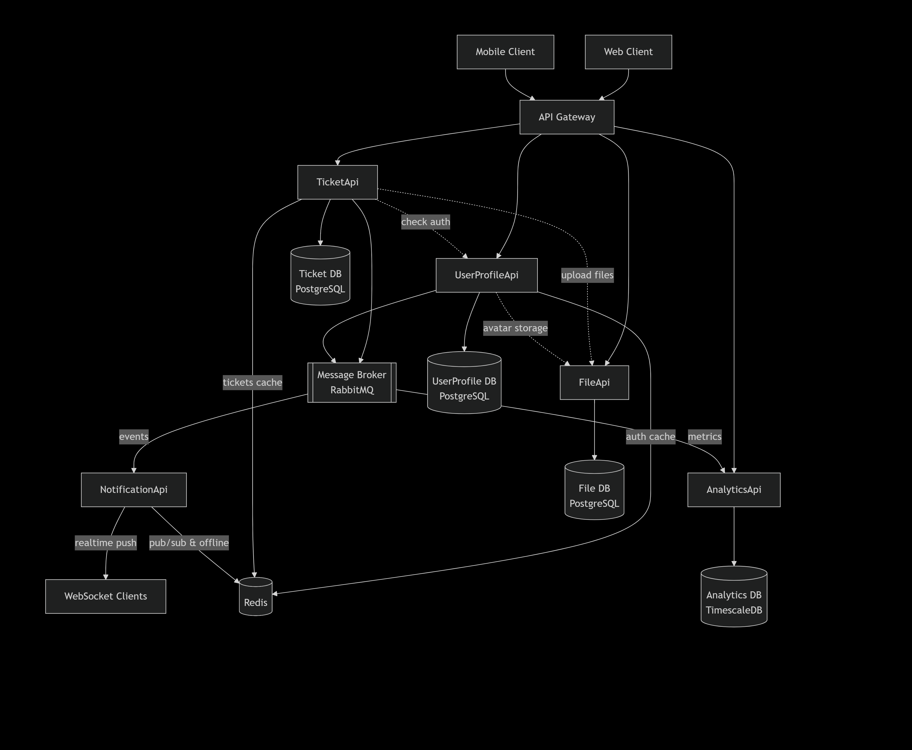

# Service Desk System

## Описание
Внутренняя система для управления инцидентами и сервисными запросами. Автоматизирует полный жизненный цикл заявки: от создания сотрудником до назначения, работы и закрытия исполнителем. Обеспечивает прозрачность процессов и контроль сроков за счёт встроенной аналитики по времени обработки, загрузке сотрудников и статистике по типам запросов.

## Функциональные требования
- Управление учётными записями и ролями (Сотрудник, Поддержка, Менеджер)
- Управление жизненным циклом заявок с возможностью установки категорий, приоритетов и статусов
- Ведение обсуждений по заявке через комментарии и вложения файлов
- Рассылка уведомлений о ключевых событиях в реальном времени
- Поиск и фильтрацию заявок по истории, статусу, исполнителю и приоритету
- Сбор аналитики и формирование отчетности по ключевым метрикам эффективности

## Нефункциональные требования
- Производительность: время отклика API не более 500 мс
- Масштабируемость: возможность горизонтального масштабирования ключевых сервисов
- JWT-аутентификация и авторизация
- Логирование и мониторинг состояния сервисов (health checks)
- Удобный и документированный API для взаимодействия с клиентскими приложениями

## Микросервисы и зоны ответственности
### 1. UserProfileApi

Управление пользователями:
- Регистрация и аутентификация.
- Управление ролями и доступами.
- Хранение и редактирование профилей пользователей.

### 2. TicketApi
   
Управление заявками:
- CRUD операций по заявкам.
- Статусы, категории, приоритеты.
- Комментарии и обсуждения по заявкам.
- Привязка вложенных файлов.

### 3. FileApi

Хранение файлов:
- Загрузка и хранение изображений/документов.
- Ссылки на файлы для заявок и профилей.

### 4. NotificationApi

Realtime-уведомления:
- Отправка уведомлений о событиях (назначение заявки, комментарий, смена статуса).
- SignalR/WebSocket-подключения для сотрудников.

### 5. AnalyticsApi

Сбор и анализ данных:
- Метрики по времени обработки заявок.
- Отчёты по загруженности сотрудников.
- Статистика по типам и приоритетам запросов.

### 6. API Gateway
- Централизованная точка входа.
- Маршрутизация запросов.
- Кеширование ответов.
- Circuit breaker.

### *
Microservices architecture by Artsofte
*
